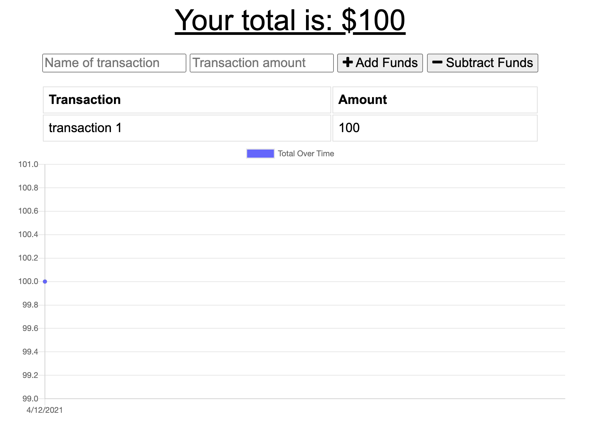

# Offline-Budget-Tracker

# Table of Contents

-[Description](#description)
-[Installation](#installation)
-[Usage](#usage)
-[Contribution](#contribution)
-[Test](#test)
-[Questions](#questions)

# Description:

* Offline-Budget Tracker is a budgeting app that allows you to make changes to your budget app offline, and the changes will sync once you connect to the internet 

# Installation:

* Installation mongoose, heroku database.

# Usage:

* Input your budget changes on or offline 

# Contribution:

* Commit your update suggestions to GitHub for review and to be merged

# Test:

* None

* Click on the link below to view the live app.
-[Link to the live app](https://offline-budget-tracker-1.herokuapp.com/)

* Below is a screen shot of the app.

# Questions:
Click on the link below to go to my GitHub page, for additional questions:
-[GitHub Portfolio](https:github.com/hectordiazjr)

Email me at hectordiaz1103@gmail.com with further questions